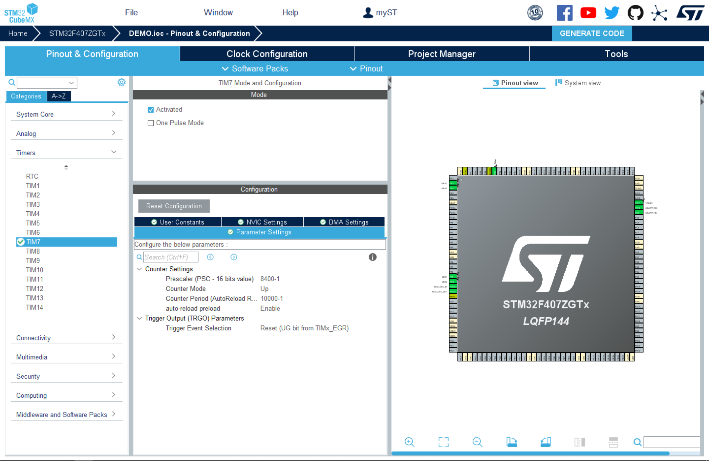

# YF-S401水流量传感器

## 简介


​	水流量传感器主要由塑料阀体、水流转子组件和霍尔传感器组成。装在热水器进水端，用于检测进水流量，当水通过水流转子组件时，磁性转子转动并且转速随着流量变化而变化，霍尔传感器输出相应脉冲信号，反馈给控制器，由控制器判断水流量的大小，进行调控。该模块以霍尔传感器为核心器件，每流经1L水就会产生固定的脉冲，有着三种型号：YF-S201(4分G1/2螺纹接口)、YF-S401(6mm软管接口)，以及YF-S401(6mm软管)。型号不同的水流量传感器每升水流量产生的脉冲数不同，本文以YF-S401为例。

|     特性     |      参数       |
| :----------: | :-------------: |
| 额定工作电压 |  DC3.5 5V-12V   |
| 最大工作电流 |   15mA (DC5V)   |
|   允许耐压   | 水压1.75Mpa以下 |
|   温度范围   |    ≤80&deg;C    |

## 接线

| YF-S401 |    描述    |
| :-----: | :--------: |
| VCC(红) | 正极，接5V |
| GND(黑) | 负极，接地 |
| OUT(黄) |  信号输出  |

## 执行流程

​	首先进行引脚配置及初始化、外部中断配置与初始化、以及定时器设置。随后，利用定时器设定1秒的时间间隔，计算在此时间段内触发的中断次数，通过中断次数推算水流量。


# 工程介绍

​	本次代码实现按键控制继电器实现12V直流水泵抽水并计算累计出水量和瞬时出水量，使用串口打印。在找到的水流传感器的参考代码中，只有4分管和6分管的流量系数而没有6mm水管的，所以自己测了一下YF-S401水流传感器在出水1L时大概会产生4800个脉冲（脉冲数有点离谱），以这个数据计算水流量并最后实现了功能。

## 外部中断计数

### CubeMX配置

设备为**STM32F407ZGT6**

1. 外部中断配置

- 配置PA11为外部中断引脚
- 下降沿触发，配置成上拉


2. 定时器中断配置

- 使用基本定时器TIM7，设置Prtscaler (定时器分频系数)为8400-1，Counter Period（自动重装载值）为10000-1

- Counter Mode为向上计数模式，并自动重装使能

- $$
  定时器溢出时间:T_{out} = \frac{{(arr + 1) \times (psc + 1)}}{T_{clk}}
  $$



3. NVIC配置


### 代码实现

1. 定时器中断

在初始化后开启TIM7中断

```c
  HAL_TIM_Base_Start_IT(&htim7);
```

2. 定时器中断回调函数

```c
void HAL_TIM_PeriodElapsedCallback(TIM_HandleTypeDef *htim)
{
    if (htim == (&htim7))
    {
        golbal_flow.receive_flag = 1;
    }
}
```

3. 外部中断

外部中断回调函数中，实现按键对继电器的通断的控制和水流传感器的脉冲计数

```c
void HAL_GPIO_EXTI_Callback(uint16_t GPIO_Pin)
{
	if(GPIO_Pin == KEY1_Pin)
	{
		HAL_Delay(10);
		if(HAL_GPIO_ReadPin(KEY1_GPIO_Port,KEY1_Pin) == 0)
		{
            HAL_GPIO_WritePin(GPIOB,GPIO_PIN_7,1);  //控制继电器通水
            golbal_flow.acculat = 0.0;              //清空累计流量
		}
	}
    if(GPIO_Pin == KEY2_Pin)
	{
        HAL_Delay(10);
        if(HAL_GPIO_ReadPin(KEY2_GPIO_Port,KEY2_Pin) == 0)
		{
            HAL_GPIO_WritePin(GPIOB,GPIO_PIN_7,0);	//控制继电器停水
		}
    }
    if(GPIO_Pin == YFS401_Pin)
	{
        golbal_flow.pluse_1s++;           //下降沿采集脉冲数
    }
}
```

4. 水流量计算

```c
#include "YFS401.h"

GOLBAL_FLOW golbal_flow;

// 定义流量模型的枚举类型
typedef enum {
    MODE_4_PIPE = 0,   // 四分管
    MODE_6_PIPE = 1,   // 六分管
    MODE_6MM_PIPE = 2  // 6mm管
} FlowModel;

// 定义流量参数
float flowK[3] = {5.0f, 5.5f, 80.0f};                  // 流量系数 K
float pulseCntPerLiter[3] = {300.0f, 330.0f, 4800.0f}; // 每升水脉冲数

// 定义 Flow_Model
FlowModel flowModel = MODE_6MM_PIPE; // 默认使用6mm管


uint32_t pluse1L;           //测试1L水的脉冲数

//==============================================================================
// @函数: Flow_Read(void)
// @描述: 读取流量
// @参数: None
// @返回: None
// @时间: 2024.2.26
//==============================================================================
void Flow_Read(void)
{
    // 根据 Flow_Model 选择不同的流量参数
    float flowKValue = flowK[flowModel];
    float pulseCntValue = pulseCntPerLiter[flowModel];
    
	if(golbal_flow.pluse_1s > 0)
	{
		golbal_flow.acculat += (golbal_flow.pluse_1s * 1000 / pulseCntValue);   //单位mL
		pluse1L+=golbal_flow.pluse_1s;
		golbal_flow.instant = golbal_flow.pluse_1s / flowKValue;  //单位（L/min）

        if(golbal_flow.acculat >= 1000000)        //最大累计流量1000L
		{
			golbal_flow.acculat = 0;
		}
	}
	else
	{
		golbal_flow.instant  = 0;
	}
	
    printf("瞬间流量：%.2f（L/min） 累计流量：%.2f mL   脉冲数：%d \n",golbal_flow.instant,golbal_flow.acculat,golbal_flow.pluse_1s);
   
	golbal_flow.receive_flag = 0;   //接收完成标志位清零
    golbal_flow.pluse_1s = 0;       //脉冲数清零
}
```

根据多次测量水量并更改系数后，运行结果如下图所示：


## 外部时钟计数

### CubeMX

- 外部时钟配置

流程基本和上面一致，区别在于不配置外部中断，而是配置定时器外部时钟触发


### 代码实现

1. 定时器中断

初始化TIM2和TIM7

```c
	HAL_TIM_Base_Start(&htim2);

	HAL_TIM_Base_Start_IT(&htim7);
```

2. 定时器中断回调函数

```c
void HAL_TIM_PeriodElapsedCallback(TIM_HandleTypeDef *htim)
{
    if (htim == (&htim7))
    {
        golbal_flow.pluse_1s = __HAL_TIM_GET_COUNTER(&htim2);   //得到TIM2的脉冲计数
        __HAL_TIM_SET_COUNTER(&htim2,0);                        //TIM2计数清零
        
        golbal_flow.receive_flag = 1;
    }
}
```

3. 水流量计算

```c
#include "YFS401.h"

GOLBAL_FLOW golbal_flow;

// 定义流量模型的枚举类型
typedef enum {
    MODE_4_PIPE = 0,   // 四分管
    MODE_6_PIPE = 1,   // 六分管
    MODE_6MM_PIPE = 2  // 6mm管
} FlowModel;

// 定义流量参数
float flowK[3] = {5.0f, 5.5f, 80.0f};                  // 流量系数 K
float pulseCntPerLiter[3] = {300.0f, 330.0f, 4800.0f}; // 每升水脉冲数

// 定义 Flow_Model
FlowModel flowModel = MODE_6MM_PIPE; // 默认使用6mm管


uint32_t pluse1L;           //测试1L水的脉冲数

//==============================================================================
// @函数: Flow_Read(void)
// @描述: 读取流量
// @参数: None
// @返回: None
// @时间: 2024.2.26
//==============================================================================
void Flow_Read(void)
{
    // 根据 Flow_Model 选择不同的流量参数
    float flowKValue = flowK[flowModel];
    float pulseCntValue = pulseCntPerLiter[flowModel];
    
	if(golbal_flow.pluse_1s > 0)
	{
		golbal_flow.acculat += (golbal_flow.pluse_1s * 1000 / pulseCntValue);   //单位mL
		pluse1L+=golbal_flow.pluse_1s;
		golbal_flow.instant = golbal_flow.pluse_1s / flowKValue;  //单位（L/min）

        if(golbal_flow.acculat >= 1000000)        //最大累计流量1000L
		{
			golbal_flow.acculat = 0;
		}
	}
	else
	{
		golbal_flow.instant  = 0;
	}
	
    printf("瞬间流量：%.2f（L/min） 累计流量：%.2f mL   脉冲数：%d \n",golbal_flow.instant,golbal_flow.acculat,golbal_flow.pluse_1s);
   
	golbal_flow.receive_flag = 0;   //接收完成标志位清零
    golbal_flow.pluse_1s = 0;       //脉冲数清零
}
```

结果如下图所示：


